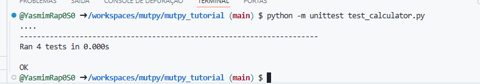

## 🧬 Características do MutPy

- ✅ Altera propositalmente o código-fonte (cria mutações)
- ✅ Verifica se os testes unitários detectam essas mudanças
- ✅ Se o teste **falha ao detectar a mutação**, o mutante **sobrevive**
- ✅ Se o teste **detecta e falha como esperado**, o mutante **é morto**

---

## 🔢 Etapas do `mutpy_tutorial`

### **Etapa 1 — Execução de testes normais**

> ✅ Execução do `unittest` sem mutações para validar o funcionamento do código original.

📸 

---

### **Etapa 2 — Problema com Python 3.12**

Ao tentar usar o MutPy com Python 3.12, ocorre erro relacionado à ausência da função `find_loader`.

🔧 Solução temporária: editar o arquivo `__init__.py` dentro do `venv`, ou utilizar uma versão anterior do Python (ex: 3.7).

---

### **Etapa 3 — Execução com mutações**

> Comando utilizado:

```bash
mut.py --target calculator --unit-test test_calculator -m
```

**Parâmetros:**
- `--target`: arquivo principal a ser testado (código com lógica)
- `--unit-test`: arquivo com os testes unitários
- `-m`: exibe as mutações realizadas no terminal

---

Saída do log:

``` sh
(venv) @YasmimRap0S0 ➜ /workspaces/mutpy/mutpy_tutorial (main) $ mut.py --target calculator --unit-test test_calculator -m
[*] Start mutation process:
   - targets: calculator
   - tests: test_calculator
[*] 4 tests passed:
   - test_calculator [0.00022 s]
[*] Start mutants generation and execution:
   - [#   1] AOR calculator: 
--------------------------------------------------------------------------------
   1: 
   2: def add(a, b):
-  3:     return a + b
+  3:     return a - b
   4: def subtract(a, b):
   5:     return a - b
   6: def multiply(a, b):
   7:     return a * b
--------------------------------------------------------------------------------
[0.00368 s] killed by test_add (test_calculator.TestCalculator.test_add)
   - [#   2] AOR calculator: 
--------------------------------------------------------------------------------
   1: 
   2: def add(a, b):
   3:     return a + b
   4: def subtract(a, b):
-  5:     return a - b
+  5:     return a + b
   6: def multiply(a, b):
   7:     return a * b
   8: def divide(a, b):
   9:     if b == 0:
--------------------------------------------------------------------------------
[0.00360 s] killed by test_subtract (test_calculator.TestCalculator.test_subtract)
   - [#   3] AOR calculator: 
--------------------------------------------------------------------------------
   3:     return a + b
   4: def subtract(a, b):
   5:     return a - b
   6: def multiply(a, b):
-  7:     return a * b
+  7:     return a / b
   8: def divide(a, b):
   9:     if b == 0:
  10:         raise ValueError('Cannot divide by zero!')
  11:     
--------------------------------------------------------------------------------
[0.00362 s] killed by test_multiply (test_calculator.TestCalculator.test_multiply)
   - [#   4] AOR calculator: 
--------------------------------------------------------------------------------
   3:     return a + b
   4: def subtract(a, b):
   5:     return a - b
   6: def multiply(a, b):
-  7:     return a * b
+  7:     return a // b
   8: def divide(a, b):
   9:     if b == 0:
  10:         raise ValueError('Cannot divide by zero!')
  11:     
--------------------------------------------------------------------------------
[0.00361 s] killed by test_multiply (test_calculator.TestCalculator.test_multiply)
   - [#   5] AOR calculator: 
--------------------------------------------------------------------------------
   3:     return a + b
   4: def subtract(a, b):
   5:     return a - b
   6: def multiply(a, b):
-  7:     return a * b
+  7:     return a ** b
   8: def divide(a, b):
   9:     if b == 0:
  10:         raise ValueError('Cannot divide by zero!')
  11:     
--------------------------------------------------------------------------------
[0.00358 s] killed by test_multiply (test_calculator.TestCalculator.test_multiply)
   - [#   6] AOR calculator: 
--------------------------------------------------------------------------------
   8: def divide(a, b):
   9:     if b == 0:
  10:         raise ValueError('Cannot divide by zero!')
  11:     
- 12:     return a / b
+ 12:     return a // b
--------------------------------------------------------------------------------
[0.00496 s] killed by test_divide (test_calculator.TestCalculator.test_divide)
   - [#   7] AOR calculator: 
--------------------------------------------------------------------------------
   8: def divide(a, b):
   9:     if b == 0:
  10:         raise ValueError('Cannot divide by zero!')
  11:     
- 12:     return a / b
+ 12:     return a * b
--------------------------------------------------------------------------------
[0.00450 s] killed by test_divide (test_calculator.TestCalculator.test_divide)
   - [#   8] COI calculator: 
--------------------------------------------------------------------------------
   5:     return a - b
   6: def multiply(a, b):
   7:     return a * b
   8: def divide(a, b):
-  9:     if b == 0:
+  9:     if not (b == 0):
  10:         raise ValueError('Cannot divide by zero!')
  11:     
  12:     return a / b
--------------------------------------------------------------------------------
[0.00364 s] killed by test_divide (test_calculator.TestCalculator.test_divide)
   - [#   9] ROR calculator: 
--------------------------------------------------------------------------------
   5:     return a - b
   6: def multiply(a, b):
   7:     return a * b
   8: def divide(a, b):
-  9:     if b == 0:
+  9:     if b != 0:
  10:         raise ValueError('Cannot divide by zero!')
  11:     
  12:     return a / b
--------------------------------------------------------------------------------
[0.00424 s] killed by test_divide (test_calculator.TestCalculator.test_divide)
[*] Mutation score [0.11672 s]: 100.0%
   - all: 9
   - killed: 9 (100.0%)
   - survived: 0 (0.0%)
   - incompetent: 0 (0.0%)
   - timeout: 0 (0.0%)
```

### 📊 Resultado da execução

> ✅ Todos os mutantes foram **detectados e eliminados** pelos testes — ou seja, excelente cobertura!


## ✅ Etapa 5 — Gerar relatório HTML
